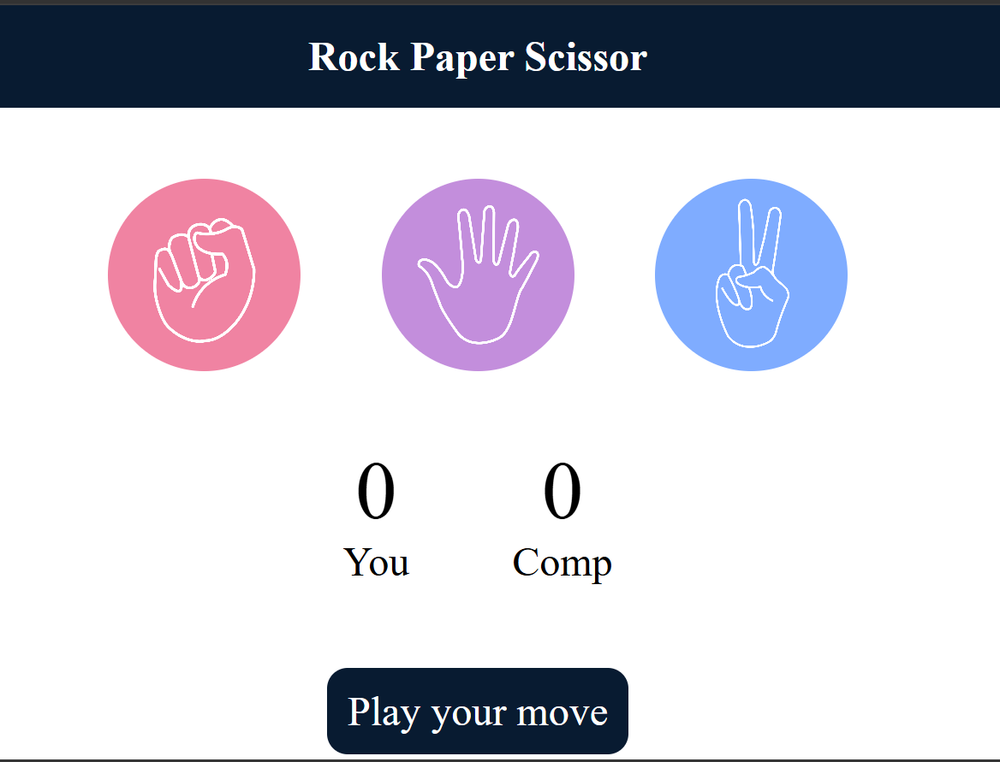

# 🎮 Rock Paper Scissors Game

An interactive and responsive Rock Paper Scissors game built with HTML, CSS, and JavaScript. Challenge the computer, track your score, and enjoy a clean and modern user interface.

## 🚀 Features

* ✨ Interactive and user-friendly design
* 🎲 Random computer-generated moves
* 📊 Real-time score tracking
* 🏆 Instant win, lose, and draw results
* 🎨 Smooth hover effects and responsive layout
* ⚡ Built using pure JavaScript (no libraries)

## 🛠️ Technologies Used

* HTML5
* CSS3
* JavaScript (ES6)

## 📸 Screenshot

## 🎯 How to Play

1. Choose Rock, Paper, or Scissors.
2. The computer makes a random choice.
3. The winner is decided according to the game rules:

   * Rock beats Scissors
   * Scissors beats Paper
   * Paper beats Rock
4. Scores are updated automatically.

## 🌐 Live Demo

[Play the Game](https://omm66.github.io/Rock-Paper-Scissors/)

## 📂 Project Structure

Rock-Paper-Scissors/
├── index.html
├── script.js
├── style.css
├── images/
│   ├── rock.png
│   ├── paper.png
│   └── scissors.png
├── screenshots/
│   └── game.png
└── README.md

## 📚 What I Learned

* DOM Manipulation
* Event Handling
* JavaScript Functions
* Conditional Logic
* Responsive Design with CSS
* Managing Application State

## 🤝 Connect With Me

If you liked this project, feel free to ⭐ the repository and check out my other projects!
